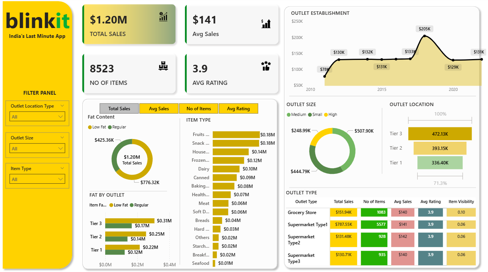

# Blinkit_Performance_Customer_Analytics

## Project Background

Blinkit, an Indian e-commerce company founded in 2013, specializes in sellin using Mobile application to order groceries and products online. I'm partnering with the Head of Operations To conduct a comprehensive analysis of Blinkit's sales performance, Customer Satisfaction and Inventory Distribution to identify key insights and oppurtunities for optimization using various KPIs and visualizations using Power BI.

## Business Requirement

To conduct a comprehensive analysis of Blinkit's sales performance, Customer Satisfaction and Inventory Distribution to identify key insights and oppurtunities for optimization using various KPIs and visualizations using Power BI.

### KPI's Requirements

- **Total Sales:** The overall revenue generated from all items
- **Average Sales:** The average revenue per sale.
- **Number of Items:** The total counts of different items sold.
- **Average Ratings:** The average customer ratings for items sold.

### Granular Requirement

**1. Total Sales By Fat Content**
- **Objective:** Analyze the impact of fat content on total sales.
- **Additional KPI Metrics:** Assess how other KPIs(Average Sales, Number of Items, Average Ratings) vary with fat content.
- **Chart Type:** Donut Chart.

**2. Total Sales by Item Type**
- **Objective:** Identify the performance of different item types in terms of total sales.
- **Additional KPI Metrics:** Assess how other KPIs(Average Sales, Number of Items, Average Rating) vary with fat content.
- **Chart Type:** Bar Chart.

**3. Fat Content By Outlet for Total Sales:**
- **Objective:** Compare total sales across different outlets segmented by Fat Content.
- **Additional KPI Metrics:** Assess how other KPIs(Average Sales, Number of Items, Average Rating) vary with fat content.
- **Chart Type:** Stacked Column Chart.

**4. Total Sales by Outlet Establishment:**
- **Objective:** Evaluate how the age or type of outlet establishment influences total sales.
- **Chart Type:** Line Chart.

### Chart's Requirements

**1. Percentage of Sales by Outlet Size:**
- **Objective:** Analyze the correlation between outlet size and total sales.
- **Chart Type:** Donut/Pie Chart.

**2. Sales by Outlet Location:**
- **Objective:** Assess the geographic distribution of sales across diffrent locations.
- **Chart Type:** Funnel Map

**3. All Metrics by Outlet Types:**
- **Objective:** Provide a comprehensive view of all key metrics(Total Sales, Average Sales, Number of Items, Average Rating) broken down by different outlet types.
- **Chart Type:** Matrix Card.

## Dashboard

## Insights

### Sales Performance

- Total Sales: $1.20M — healthy performance overall.

- Average Sales per item: $141 — indicates moderate individual item sales.

### High contributing categories:

- Regular fat items ($776.32K) perform better than low fat items ($425.36K).

- **Top-selling item types:** Fruits, Snacks, Household, and Frozen foods (~$0.18M each).

### Outlet Analysis By Size:

- Medium outlets dominate with $507.90K in sales.

- Small outlets contribute $248.99K — may have untapped potential.

- High-size outlets bring in $444.79K — strong performers but may be underutilized.

- Sales peaked around 2018 ($205K) — might indicate strategic expansion or demand surge.

- A dip in 2021-22 — possibly due to COVID or operational shifts.

### Geographical Insights

- Tier 3 cities lead with $472.13K in sales — suggests strong Blinkit adoption in smaller cities.

- Tier 1 cities are lowest at $336.40K, possibly due to heavy competition or saturation.

### Outlet Type Performance

- Supermarket Type1 dominates in all KPIs — indicating it's the most efficient and well-stocked type.

- Grocery stores have the highest item visibility (0.10), suggesting better individual product discovery.

### Opportunities for Optimization

- Focus Marketing in Tier 1 Cities: Low sales here indicate room for promotional growth.

- Expand Medium-Size Outlets: Given their high sales, consider more investments here.

- Optimize Underperforming Item Types: Seafood, Starch, and Others underperform — may need bundling or removal.

- Explore Low-Fat Trends: Though lower in total sales, low-fat products are gaining traction — a future growth point.

- Track Recovery Post-2020: Analyze reasons for the dip in sales after 2018 peak and strategize accordingly.

